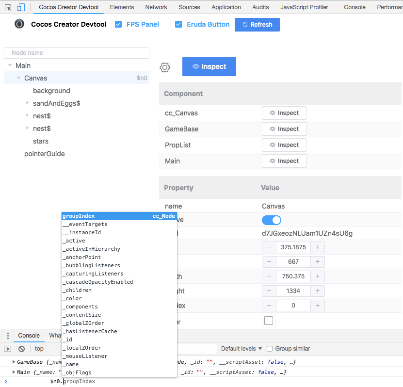

# Cocos Creator Devtool
Cocos Creator Devtool is an extension for Google Chrome Devtools. 
It allows you to inspect the Cocos Creator game scenes in a web page.

You can install [Cocos Creator Devtool](https://chrome.google.com/webstore/detail/cocos-creator-devtool/cnmkiolbnmjlhdkabcgobbgdomhhdnho)
from Chrome Webstore.

# Changelog

## 1.0.2
- Buttons for inspecting components on node
- Change node properties with "+/-" button
- Automatically reload tree on page refreshing and scene loading
- Now you can play with selected node in Console with `$n0`,`$n1` just like `$0` and `$1` in Chrome devtool for normal web page

## 1.0.1
- Node tree
- Inspect node basic properties
